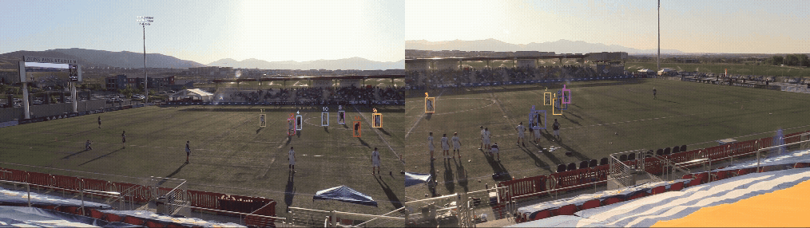
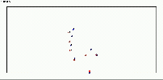

## UFATrack Dataset

UFATrack is a professional Ultimate Frisbee dataset released with synchronized **video and tracking** to support reproducible research and practitioner use.

### Source / Scope

- Match: **Oakland Spiders vs Salt Lake Shred** (score: OAK 4–9 SLC)
- Date: **June 27, 2025**
- Segment: **2nd quarter**
- Effective play included: **~9.5 minutes** (excluding pulls and offense–defense transitions)
- Possessions: **20 possession sequences**
- Filming: **the left and right halves of the court were recorded separately**

### Sampling & Coordinates

- Coordinate system: metric (x, y) on a standard pitch of **109.73 m × 48.77 m**
- Per frame: positions of **all 14 on-field players + the disc**
- Video: **30 fps**, tracking: **10 fps**

### Disc position definition

- Disc position is obtained by annotating the **disc holder**
- When no player is in possession, disc location is **linearly interpolated** between consecutive possession events

---

## Raw UFATrack columns (overview)

Each row = one object (player/disc) at one `frame`.

- `frame`, `id`: frame number and object ID (`class=="disc"` indicates the disc row).
- `x`, `y`: position (meters).
- `vx`, `vy`, `ax`, `ay`: velocity/acceleration components.
- `v_mag`, `a_mag`: speed/acceleration magnitude.
- `v_angle`, `a_angle`: velocity/acceleration direction angle.
- `diff_v_a_angle`, `diff_v_angle`, `diff_a_angle`: derived angle-difference features.
- `class`: role label (`offense` / `defense` / `disc`).
- `holder`: `True` for the disc-holding player at that frame.
- `closest`, `selected`, `prev_holder`, `def_selected`: helper fields for analysis/preprocessing.

---

## Generate Event/Tracking Data via OpenSTARLab PreProcessing

You can convert the raw UFATrack file into standardized **Event data** and **Tracking data** using the OpenSTARLab preprocessing pipeline. The preprocessing module merges and aligns raw inputs, normalizes coordinates, attaches context (team/period labels), and produces an analysis-ready **space-data** representation that can be used directly by downstream evaluation modules (e.g., SpaceEval).

### Repository

OpenSTARLab PreProcessing (GitHub): [here](https://github.com/open-starlab/PreProcessing)
